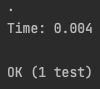

# 리팩토링 Part 4 : 테스트 작성

### 머릿말

앞서 1장에서 말했듯 리팩토링을 위해 가장 먼저 필요한 필수 전제조건은 바로 견고한 테스트다. IDE를 통해 리팩토링 기법을 쉽게 적용할 수 있대도 테스트는 반드시 필요하다. 저자는 단위 테스트를 어떻게 시작하게 되었는지 본인의 경험을 소개한다. 놀랍게도 그 계기는 OOPSLA의 컨퍼런스에서 “실용주의 프로그래머"의 공동 저자 데이트 토머가 했던 한마디였다.

> ‘클래스엔 test라는 이름의 자체 테스트 메서드를 꼭 넣어야 한다’라는 식으로 말했다.
> 

---

### 자가 테스트 코드의 가치

- 어쩌면 우린 대부분의 리소스를 테스트에 투자하고 있을 지도 모른다. 물론 이 말은 단위 테스트를 작성하지 않는 개발자에 한해서다. 그리고 개발하면서 버그가 생기는 경우 이런 케이스는 훨씬 더 늘어난다. 테스트 스위트는 사실 해보기 전까진 왜 중요한지 알지 못한다. 테스트는 분명히 버그를 찾는 시간을 획기적으로 줄여주는 아주 강력한 버그 감지 도구다.
- 그렇다면 테스트는 언제 작성하는게 좋을까? 대부분은 테스트를 하는 시점은 즉 개발이 끝난 시점이라고 생각할 것이다. 테스트할 코드도 없는데 테스트 코드를 작성한다는 것이 모순적이라고 느껴질 수 있다. 하지만 가장 적합한 시점 중 하나는 사실 코드 작성을 시작할 때다. 즉 실제 요구사항에 대해 프로덕션 코드를 시작하기도 전에 테스트를 먼저 작성하라는 것이다.
    - 이것의 이유는 우리가 요구사항을 실제로 구현하기 전에 테스트 코드를 작성하게 되면 해당 기능이 결국 어떤 것을 위한 것인지를 되돌아보게 된다.
    - 테스트는 우리가 실제 프로덕션 코드의 구현이 아닌 기능의 인터페이스에 집중하게 만들어준다.
    - 자 그럼 이제 JUnit 테스트 프레임워크를 사용해 테스트를 작성해보자.
        - JUnit 프레임워크는 에릭 개머와 켄트 백이 만든 오픈소스 테스트 프레임워크이며, 컴퍼지트 패턴을 사용해 작성되었다.
    
- 먼저 FileReader 클래스를 테스트하는 FileReaderTest 클래스부터 작성해보자.
    - 주의사항으로 서적에서는 JUnit 3을 사용하고 있다. 글 본문은 JUnit3로 정리하지만 소스코드로는 JUnit5 버전도 작성할 예정이다.
    - 먼저 테스트 클래스를 만들어보자
        
        ```java
        import junit.framework.TestCase;
        
        public class FileReaderTester extends TestCase {
        		public FileReaderTester(String name) {
                super(name);
            }
        }
        ```
        
        - 테스트 코드 추가를 위해선 우선 생성자가 필요하다.
    - 다음으론 테스트의 샘플 역할을 담당하는 테스트 픽스처를 만들어보자.
        - 픽스처는 간단한 텍스트 파일이다.
            
            ```
            Bradman 99.94 52 80 10 6996 334 29
            Pollock 60.97 23 41 4 2256  274 7
            Headley 60.83 22 40 4 2256 270* 10
            Sutcliffe 60.73 54 84 9 4555 194 16
            ```
            
        - Junit은 TestCase 클래스에서는 픽스처를 조작하기 위해 픽스처 객체를 생성하기 위한 setUp, 제거하기 위한 tearDown 메서드를 제공한다.
            
            ```java
            protected void setUp(){
                try {
                    input = new FileReader("data.txt");
                } catch (FileNotFoundException e) {
                    throw new RuntimeException("테스트 파일을 열 수 없음");
                }
            }
            
            protected void tearDown(){
                try {
                    input.close();
                } catch (IOException e) {
                    throw new RuntimeException("테스트 파일을 닫는 중 에러 발생");
                }
            }
            ```
            
- 자 이제 본격적으로 테스트를 작성해보자.
    - 첫 번째로는 4개의 문자를 읽고 해당 문자가 일치하는지를 확인하는 읽기 메서드다.
        
        ```java
        public void testRead() throws IOException {
            char ch = '&';
            for (int i = 0; i < 4; i++) {
                ch = (char) input.read();
            }
            assert('d' == ch);
        }
        ```
        
        - 여기서 테스트의 통과는 assert문이 담당한다.
    - 이제 테스트 케이스의 상위 그룹인 테스트 스위트를 생성해보자.
        
        ```java
        import junit.framework.Test;
        import junit.framework.TestSuite;
        
        public static Test suite(){
            TestSuite suite = new TestSuite();
            suite.addTest(new FileReaderTester("testRead"));
            return suite;
        }
        ```
        
        - 테스트 스위트를 생성하고 우리가 방금 작성한 TestCase 객체를 넣었다.
        - 여기서 TestCase에 작성된 테스트 대상인 메서드의 이름을 생성자 인자로 넣어주었다. 이름으로 넘겨진 테스트는 리플렉션 기능을 통해 TestCase에 연결된다.
        - 자 이제 실행시켜보자
    - 테스트를 실행하기 위해선 TestRunner 클래스가 필요하다. TestRunner는 GUI 혹은 콘솔의 텍스트로 결과를 보여준다.
        
        ```java
        public static void main(String[] args) {
            junit.textui.TestRunner.run(suite());
        }
        ```
        
        - 실행결과를 아래와 같이 보여준다. 실행에 걸린 시간도 모두 출력하며 통과 혹은 실패한 테스트 갯수까지 모두 보여준다. 또한 최대한 간결하게 전달해 테스트에 피로감을 줄인다.
            
            <p align="center"></p>
            
        - 여기서 단정문을 assertEquals로 변경해주면 에러 문구를 좀더 개선되게 출력할 수 있다.
            
            → assertEqual 출력
            
        - assertEquals() 메서드를 통해 객체, 값에 대한 검사가 가능하다. 객체 비교에는 equlas(), 값 비교에는 == 연산자
    - JUnit 프레임워크는 실패만 잡는게 아니라 예러도 잡아낸다. 실패와 에러는 다르다.
        - 실패는 어셜션 결과가 실패로 출력되고 에러는 예외가 출력된다.
        - 만약 파일 스트림과 관련된 에러를 출력하고자 한다면 아래처럼
            
            ```java
            public void testRead() throws IOException { char ch = '&';
            		_input.close();
            		for (int i=0; i < 4; i++)
            		ch = (char) _input.read(); assertEquals('m',ch);
            }
            ```
            

- Junit 프레임워크는 단위 테스트용 프레임워크다.
    - 단위 테스트와 기능 테스트는 엄연히 그 목적이 다르다.
        - 단위 테스트의 목적은 프로그래밍 생산성 향상이다.
        - 매우 작은 범위를 테스트한다.
    - 기능 테스트는 단위 테스트와 전혀 다른 존재다.
        - 기능 테스트의 목적은 소프트웨어 전반이 제대로 돌아가는지를 확인하는 것이다. 즉 고객에게 품질 보증을 하기 위한 목적이며 생산성과는 무관하다.
        - 또한 기능 테스트는 블랙박스 테스트다.

- 우리는 아직 추가할 테스트가 많다. 너무 쉬운 코드를 테스트하는 것은 의미가 없다.
    - 단위 테스트에서는 경계 조건을 테스트하는 것을 명심하자.
        
        ```java
        public void testReadBoundaries()throwsIOException { assertEquals("read first char",'B', _input.read()); int ch;
        		for (int i = 1;i <140; i++)
        		ch = _input.read();
        		assertEquals("read last char",'6',_input.read()); assertEquals("read at end",-1,_input.read());
        }
        ```
        
    - 또한 테스트를 실패하게 할 가능성이 있는 특수 조건도 찾아야 한다.
        
        ```java
        public void testEmptyRead() throws IOException { File empty = new File ("empty.txt"); FileOutputStream out = new FileOutputStream out.close();
        FileReader in = new FileReader (empty);
        assertEquals (-1, in.read()); }
        ```
        
    - 테스트를 실시할 때에는 반드시 예상한 에러가 제대로 발생하는지도 검사해야한다.
        
        ```java
        public void testReadAfterClose() throwsIOException{ _input.close();
        try {
        _input.read();
        fail ("no exception for read past end"); } catch (IOException io) {}
        }
        ```
        
    - 테스트는 위험이 있는 곳에 집중시켜야 한다.
        - 복잡해지는 곳을 파악하고 함수를 살피며 에러 가능성이 높은 부분을 생각하자.